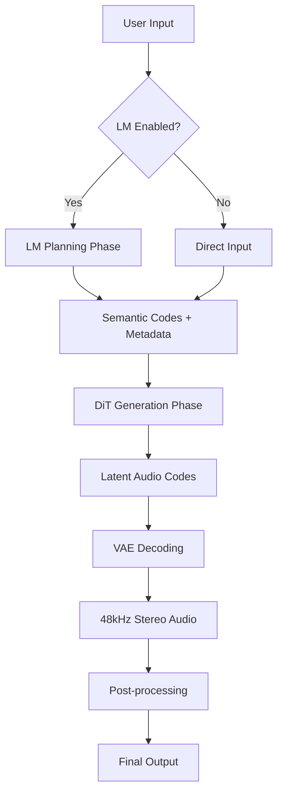

## Overview

ACE-Step 1.5 generates music through a multi-stage pipeline that transforms text and audio inputs into high-quality stereo waveforms. Understanding this process helps you make better creative decisions and optimize generation parameters.

## Complete Generation Pipeline



## Phase 1: Input Processing

### Text Input Validation

The system first validates and normalizes all text inputs:

**Caption Processing:**
- Validates caption is not empty (unless reference audio provided)
- Strips excessive whitespace and formatting
- Checks for conflicting style descriptions
- Prepares for LM rewriting (if enabled)

**Lyrics Processing:**
- Parses structure tags (`[Verse]`, `[Chorus]`, etc.)
- Validates tag syntax and placement
- Checks syllable count consistency
- Ensures lyrics align with specified duration
- Detects language for multi-lingual support

**Metadata Normalization:**
- BPM: Clamps to 30-300 range
- Duration: Adjusts to GPU tier limits
- Key/scale: Validates musical notation
- Time signature: Ensures valid format (e.g., 4/4, 3/4)

### Audio Input Processing

When reference or source audio is provided:

**Audio Loading:**
```python
# ACE-Step normalizes all audio to standard format
Target format: 48kHz, stereo (2 channels), float32
Supported inputs: WAV, MP3, FLAC, OGG, M4A
```

**Reference Audio Processing:**
1. Load and resample to 48kHz stereo
2. Detect silence (skip if completely silent)
3. If &lt;30s, repeat to fill 30s minimum
4. Extract 10s segments from front, middle, back (30s total)
5. Encode to latent space via VAE
6. Average temporal dimension for global timbre conditioning

**Source Audio Processing (Cover/Repaint):**
1. Load and resample to 48kHz stereo
2. Encode entire audio via VAE
3. For Cover: Extract semantic codes at 5Hz (5 codes per second)
4. For Repaint: Keep specified time range as context

<Info>
  Reference audio provides **global timbre** (averaged), while source audio provides **structured semantics** (time-preserved).
</Info>

## Phase 2: LM Planning (Optional)

If LM is initialized and enabled, the Language Model performs Chain-of-Thought reasoning.

### CoT Reasoning Flow

**Step 1: Prompt Construction**

The LM receives a structured prompt:
```
System: You are a music generation planner...

User caption: [user's caption]
User lyrics: [user's lyrics]
Reference audio info: [if provided]
Existing metadata: [if provided]

Task: Generate semantic codes and infer metadata for music generation.
```

**Step 2: Metadata Inference**

LM reasons about appropriate musical characteristics:

```
Thinking:
- Caption "energetic rock anthem" suggests:
  - Fast tempo: BPM 130-145
  - Common time: 4/4
  - Major key for uplifting feel: likely E, A, or D major
  - Electric instruments: guitar, bass, drums
  - Powerful vocals: likely male, belted
  
Inferred metadata:
  BPM: 135
  Key: E Major
  Time Signature: 4/4
  Duration: 180s (3 minutes for full anthem structure)
```

**Step 3: Caption Rewriting**

LM expands simple prompts into detailed descriptions:

```
Original: "sad piano song"

Expanded: "melancholic piano ballad with female breathy vocal, 
intimate atmosphere, gentle strings in background, slow tempo, 
emotional delivery, reverb-heavy production, lo-fi aesthetic"
```

This expansion:
- Adds missing instrumental details
- Specifies vocal characteristics
- Includes production style hints
- Provides emotional context
- Suggests mixing approach

**Step 4: Semantic Code Generation**

The LM generates semantic codes (5Hz frequency):
- Each code represents 200ms of music
- Codes encode melody, harmony, rhythm structure
- Contain partial timbre information
- Guide DiT on composition and arrangement

**Constrained Decoding:**

ACE-Step uses constrained decoding to ensure valid output:
- Forces structured JSON format
- Validates metadata ranges
- Ensures code sequence length matches duration
- Prevents hallucination of invalid tokens

### LM Backend Differences

**vLLM Backend (Recommended for NVIDIA/AMD GPUs ≥8GB):**
- PagedAttention for efficient KV cache
- Continuous batching for throughput
- ~0.5-2s for typical CoT generation
- Best for production workloads

**PyTorch Backend (Universal fallback):**
- Standard HuggingFace generation
- Lower VRAM usage
- ~1-3s for typical CoT generation
- Compatible with all platforms

**MLX Backend (Apple Silicon):**
- Native Metal acceleration
- Unified memory architecture
- ~1-2s for typical CoT generation
- Optimal for M1/M2/M3 Macs

### LM Temperature and Sampling

The LM uses nucleus sampling with configurable parameters:

```python
lm_temperature = 0.85  # Default
lm_top_p = 0.9
lm_top_k = 0  # Disabled
lm_cfg_scale = 2.0  # Classifier-free guidance
```

**Temperature effects:**
- `0.0-0.5`: Deterministic, conservative, safe choices
- `0.6-0.9`: Balanced creativity and coherence (recommended)
- `1.0-1.5`: Creative, unpredictable, experimental

<Warning>
  Very high temperature (>1.2) can cause incoherent metadata or invalid codes. Use with caution.
</Warning>

## Phase 3: DiT Generation

The Diffusion Transformer generates audio in latent space through iterative denoising.

### Conditioning Preparation

**Text Encoding:**
- Caption encoded via CLIP-style text encoder (1024-dim)
- Lyrics encoded via specialized lyric encoder (8 layers)
- Structure tags parsed and embedded separately
- All text conditions concatenated and projected

**Audio Encoding:**
- Reference audio: Timbre features (64-dim) via timbre encoder
- Source audio (Cover): Semantic codes (2048-dim FSQ codes)
- Source audio (Repaint): Context latents for specified range

**Metadata Embedding:**
- BPM, key, time signature embedded as learnable tokens
- Duration used for sequence length calculation
- Vocal language embedded for multi-lingual support

### Diffusion Process

**Noise Schedule:**

ACE-Step uses a learned noise schedule controlled by shift parameter:

```python
# Timestep distribution
shift = 1.0  # Default for Turbo
# Higher shift → more steps on structure
# Lower shift → more steps on details

Timesteps generated based on:
- Total steps (8 for Turbo, 50 for SFT/Base)
- Shift parameter (adjusts distribution)
- Inference method (ODE vs SDE)
```

**Denoising Loop:**

```python
for step in range(num_steps):
    # 1. Current timestep
    t = timesteps[step]
    
    # 2. Predict noise
    noise_pred = dit_model(
        noisy_latent,
        t,
        caption_embed,
        lyric_embed,
        metadata_embed,
        timbre_embed,  # if reference audio
        semantic_codes  # if cover mode
    )
    
    # 3. Apply guidance (CFG, if enabled)
    if use_cfg:
        noise_pred_uncond = dit_model(noisy_latent, t)  # no conditions
        noise_pred = noise_pred_uncond + 
                     guidance_scale * (noise_pred - noise_pred_uncond)
    
    # 4. Denoise step
    noisy_latent = scheduler.step(noise_pred, t, noisy_latent)
```

**Inference Methods:**

| Method | Characteristics | Use Case |
|--------|----------------|----------|
| **ODE** | Deterministic, same seed = same output | Default, reproducible |
| **SDE** | Stochastic, adds randomness each step | More variation, exploration |

**Classifier-Free Guidance (CFG):**

Only available for SFT and Base models:

```python
guidance_scale = 7.0  # Default

# Scale 1.0 = no guidance (pure model prediction)
# Scale 7.0 = balanced (recommended)
# Scale 15.0 = maximum adherence (may overfit)
```

CFG strengthens prompt adherence by contrasting conditioned vs. unconditioned predictions.

### DiT Attention Mechanisms

**Sliding Window Attention:**
- Alternating layers use sliding window (128 tokens) or full attention
- Reduces memory for long sequences
- Maintains global context via attention pooling

**Patch-Based Processing:**
- Latents divided into patches (patch_size=2)
- Reduces sequence length for efficiency
- Reconstructed during VAE decoding

### Task-Specific Generation

**Text2Music (Default):**
```
Random noise → Apply text conditions → Denoise → Output latent
```

**Cover Mode:**
```
Source codes → Add noise (controlled by cover_strength) → 
Apply new caption/lyrics → Denoise → Output latent
```

**Repaint Mode:**
```
Source latent (context) + Random noise (edit region) → 
Apply conditions → Denoise edit region → Blend with context → Output latent
```

**Extract (Base only):**
```
Mixed audio latent → Apply stem extraction conditioning → 
Denoise → Output isolated stem latent
```

**Lego (Base only):**
```
Existing track latents + Random noise (new track) → 
Apply new instrument conditioning → Denoise → Combine tracks → Output latent
```

**Complete (Base only):**
```
Single track latent (e.g., vocals) → 
Apply accompaniment conditioning → Denoise → Output full mix latent
```

## Phase 4: VAE Decoding

The Variational Autoencoder converts latent codes back to audio waveforms.

### Latent to Audio Conversion

**Decoding Process:**

1. **Reshape latents**: From patches back to continuous sequence
2. **Tiled decode**: Process in chunks to manage VRAM
3. **Upsampling**: Latent rate (5Hz) → Audio rate (48kHz)
4. **Stereo reconstruction**: Generate left and right channels

**Adaptive Tiling:**

ACE-Step automatically adjusts chunk size based on available VRAM:

```python
# Chunk sizes (in frames at 5Hz)
VRAM ≥20GB: 1536 frames (307s audio per chunk)
VRAM 12-20GB: 1024 frames (205s audio per chunk)
VRAM 8-12GB: 512 frames (102s audio per chunk)
VRAM 4-8GB: 256 frames (51s audio per chunk)
VRAM &lt;4GB: 128 frames (26s audio per chunk)
```

Chunks overlap by 10% for smooth transitions.

### Three-Tier Fallback

If VRAM is insufficient, the system cascades through fallback modes:

**Tier 1: GPU Tiled Decode**
```python
VAE on GPU → Process chunks sequentially → Concatenate
```

**Tier 2: GPU Decode with CPU Offload**
```python
Move other models to CPU → VAE on GPU → Decode → Restore models
```

**Tier 3: Full CPU Decode**
```python
Move VAE to CPU → Decode on CPU → Much slower but always works
```

<Info>
  CPU decode is ~10-20x slower but guarantees success even with 2GB VRAM.
</Info>

### Quality Characteristics

- **Frequency response**: 20Hz - 20kHz (full audio spectrum)
- **Bit depth**: 16-bit (exported as WAV) or variable (MP3)
- **Sample rate**: 48kHz stereo
- **Latency**: Codec latency ~200ms (12.5:1 compression at 5Hz)

## Phase 5: Post-Processing

### Quality Scoring (Optional)

ACE-Step can automatically score generated audio:

**DiT Lyrics Alignment Score:**
- Measures alignment between lyrics and actual audio
- Higher score = better lyric positioning accuracy
- Useful for filtering batch generations
- Score range: 0.0 (poor) to 1.0 (excellent)

**Additional Metrics:**
- Audio quality assessment
- Structure coherence
- Timbre consistency

<Check>
  Enable AutoGen + quality scoring to automatically generate and filter multiple variants.
</Check>

### LRC Generation (Optional)

For lyric-based generations:

1. Analyze audio for vocal onsets
2. Align lyrics to detected timing
3. Generate synchronized .lrc file
4. Format: `[mm:ss.xx] lyric line`

### Format Conversion

**Default Output:**
- Format: WAV (uncompressed)
- Sample rate: 48kHz
- Channels: 2 (stereo)
- Bit depth: 16-bit PCM

**Optional Conversion:**
- MP3 (variable bitrate, 128-320kbps)
- FLAC (lossless compression)
- OGG Vorbis (open format)

### Metadata Embedding

Generated audio can include metadata tags:
- Title (from caption)
- Artist: "ACE-Step 1.5"
- Comment: Generation parameters
- Custom tags: BPM, key, model version

## Generation Modes Deep Dive

### Text2Music Mode

**Input:**
- Caption (required)
- Lyrics (optional, use `[Instrumental]` for instrumental)
- Metadata (optional, auto-inferred if LM enabled)
- Reference audio (optional, for timbre guidance)

**Process:**
1. LM (if enabled): Rewrite caption, infer metadata, generate codes
2. DiT: Generate from random noise with all conditions
3. VAE: Decode to audio

**Use Cases:**
- Creating original compositions from scratch
- Exploring creative ideas with text prompts
- Generating background music for content

### Cover Mode

**Input:**
- Source audio (required)
- New caption (optional, modifies style)
- New lyrics (optional, modifies vocal content)
- `audio_cover_strength` (0.0-1.0, default 1.0)

**Process:**
1. Encode source audio to semantic codes
2. Add noise based on `cover_strength`:
   - 1.0 = maximum fidelity to structure
   - 0.5 = balance freedom and structure
   - 0.0 = almost ignore structure (not recommended)
3. Apply new conditions (caption/lyrics)
4. DiT: Denoise to new interpretation
5. VAE: Decode to audio

**Use Cases:**
- Style transfer (rock → jazz, acoustic → electronic)
- Reinterpret existing songs with new lyrics
- Create variations maintaining core structure
- "Remix" by changing instrumentation

**Advanced: Structure Blending**

You can combine multiple source audios:
```python
# Mix semantic codes from different sources
codes_mixed = 0.7 * codes_song_a + 0.3 * codes_song_b
# Generate hybrid structure
```

### Repaint Mode

**Input:**
- Source audio (required)
- Start/end time for edit region (required)
- New caption/lyrics for edited section
- Original remains as context

**Process:**
1. Encode source audio to latents
2. Mask edit region (repainting_start to repainting_end)
3. Keep context latents frozen
4. DiT: Generate edit region conditioned on context
5. Blend edit smoothly with context
6. VAE: Decode full audio

**Use Cases:**
- Fix specific sections (bad vocal, wrong instrument)
- Change lyrics in middle of song
- Extend intro or outro
- Modify song structure (Verse → Chorus transition)
- Seamless audio stitching

**Infinite Duration:**

Chain repaint operations:
```
1. Generate 0-90s
2. Repaint 80-170s (10s overlap for context)
3. Repaint 160-250s
... continue indefinitely
```

### Advanced Tasks (Base Model Only)

**Extract Mode:**

Separate stems from mixed audio:
```python
# Extract vocals from full mix
output = extract(
    src_audio="full_song.wav",
    target_stem="vocals"  # or "drums", "bass", "other"
)
```

**Lego Mode:**

Add new instrumental layers:
```python
# Add drums to guitar-only recording
output = lego(
    src_audio="guitar_only.wav",
    caption="add energetic rock drums",
    repainting_start=0,
    repainting_end=duration  # full duration
)
```

**Complete Mode:**

Generate full accompaniment:
```python
# Create backing track for a cappella vocals
output = complete(
    src_audio="vocals_only.wav",
    caption="indie rock instrumentation, guitar, bass, drums"
)
```

## Controlling Generation Quality

### Input Control Hierarchy

From most to least influential:

1. **Source audio** (Cover/Repaint) - Strongest structural constraint
2. **Caption** - Primary style and content guidance
3. **Lyrics + Structure tags** - Temporal organization
4. **Metadata** (BPM, key, etc.) - Fine-tuning characteristics
5. **Reference audio** - Timbre and mixing style hints

### Hyperparameter Tuning

**For Exploration (more variety):**
```python
lm_temperature = 1.0  # More creative LM
infer_method = "sde"  # Stochastic diffusion
shift = 1.0  # Balanced (Turbo default)
```

**For Consistency (reproducible):**
```python
seed = 42  # Fixed seed
lm_temperature = 0.6  # Conservative LM
infer_method = "ode"  # Deterministic diffusion
```

**For Detail:**
```python
inference_steps = 50  # SFT/Base models
guidance_scale = 10.0  # Strong prompt adherence
shift = 1.0  # Balanced detail/structure
```

**For Speed:**
```python
model = "acestep-v15-turbo"
inference_steps = 8  # Maximum speed
init_llm = False  # Skip LM
```

### Batch Generation Strategy

Leverage fast inference for exploration:

```python
# Generate multiple variants
batch_size = 4  # Generate 4 at once
enable_autogen = True  # Auto-generate new batches
enable_scoring = True  # Auto-score results

# Workflow:
# 1. Generate batch of 4
# 2. System auto-scores each
# 3. You listen to high-scoring ones
# 4. AutoGen prepares next batch in background
# 5. Repeat until satisfied
```

<Info>
  RTX 3090 can generate 4x 30s songs in ~8-15 seconds total with Turbo model.
</Info>

## Optimization Tips

### VRAM Management

**Enable compilation:**
```python
compile_model = True  # 20-30% speedup after warmup
```

**Offloading strategy:**
- &lt;12GB VRAM: Enable both CPU offload and DiT offload
- 12-20GB: Enable CPU offload only
- ≥20GB: Disable offloading

**Quantization:**
- INT8 quantization: ~40% VRAM reduction, minimal quality loss
- Automatically enabled for GPUs ≤16GB
- Requires `compile_model=True`

### Speed Optimization

**Fastest configuration:**
1. Use `acestep-v15-turbo`
2. Disable LM (or use 0.6B)
3. Enable `torch.compile`
4. Use vLLM backend (if LM enabled)
5. Reduce batch size if hitting VRAM limits

**Quality vs. Speed trade-off:**
- Turbo (8 steps): 1x time, very high quality
- SFT (50 steps): 6x time, high quality + CFG control
- SFT (25 steps): 3x time, good quality compromise

### Multi-GPU (Not yet supported)

Current version runs on single GPU. Multi-GPU support planned for:
- Tensor parallelism for large models
- Pipeline parallelism for long audio
- Data parallelism for batch processing

## Common Issues and Solutions

<AccordionGroup>
  <Accordion title="Generation doesn't match my prompt" icon="circle-exclamation">
    **Causes:**
    - Conflicting caption and lyrics
    - Vague or ambiguous descriptions
    - Rare style/instrument with limited training data
    
    **Solutions:**
    - Use more specific, detailed descriptions
    - Enable LM caption rewriting
    - Increase LM model size (1.7B → 4B)
    - Use reference audio for timbre guidance
    - Try multiple generations (explore random space)
  </Accordion>
  
  <Accordion title="Lyrics not aligned with audio" icon="music">
    **Causes:**
    - Inconsistent syllable counts
    - Missing or incorrect structure tags
    - Duration too short for lyric content
    
    **Solutions:**
    - Keep syllable counts consistent (6-10 per line)
    - Use proper structure tags (`[Verse]`, `[Chorus]`)
    - Increase duration to match lyric density
    - Use batch generation + lyrics alignment scoring
  </Accordion>
  
  <Accordion title="Audio quality degraded" icon="wave-square">
    **Causes:**
    - Too few diffusion steps
    - Extreme CFG values
    - VRAM-limited fallback to CPU decode
    
    **Solutions:**
    - Increase inference steps (8 → 16 for Turbo, 32 → 50 for SFT)
    - Use CFG 5.0-9.0 (avoid extremes)
    - Reduce batch size to keep VAE on GPU
    - Use higher-tier GPU or enable quantization
  </Accordion>
  
  <Accordion title="Generation too slow" icon="clock">
    **Causes:**
    - Using SFT/Base instead of Turbo
    - Large LM model on insufficient VRAM
    - CPU decode fallback
    - torch.compile not enabled
    
    **Solutions:**
    - Switch to Turbo model (8 steps)
    - Use smaller LM (4B → 1.7B → 0.6B → None)
    - Enable compile for 20-30% speedup
    - Reduce duration or batch size
    - Use vLLM backend for LM (if ≥8GB VRAM)
  </Accordion>
  
  <Accordion title="Out of memory errors" icon="memory">
    **Causes:**
    - Batch size too large
    - Duration exceeds GPU tier limit
    - Offloading disabled on low VRAM GPU
    
    **Solutions:**
    - Reduce batch size (8 → 4 → 2 → 1)
    - Reduce duration to tier maximum
    - Enable CPU offload and DiT offload
    - Enable INT8 quantization
    - Close other GPU-using applications
  </Accordion>
</AccordionGroup>

## Next Steps

<CardGroup cols={2}>
  <Card title="Architecture" icon="diagram-project" href="/concepts/architecture">
    Understand the hybrid LM+DiT design
  </Card>
  <Card title="Model Zoo" icon="layer-group" href="/concepts/models">
    Choose the right models for your needs
  </Card>
  <Card title="GPU Compatibility" icon="microchip" href="/concepts/gpu-compatibility">
    Optimize for your hardware
  </Card>
  <Card title="Gradio Guide" icon="window-maximize" href="/guides/gradio-ui">
    Use the web interface for generation
  </Card>
</CardGroup>